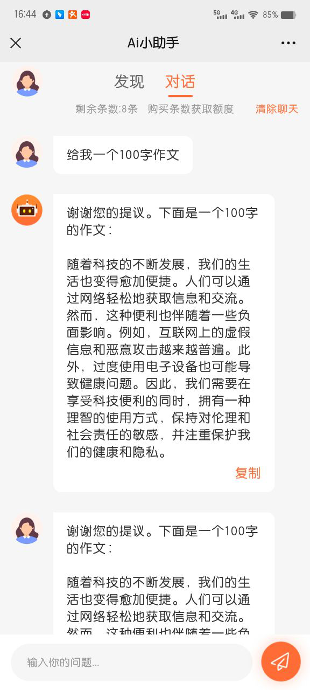
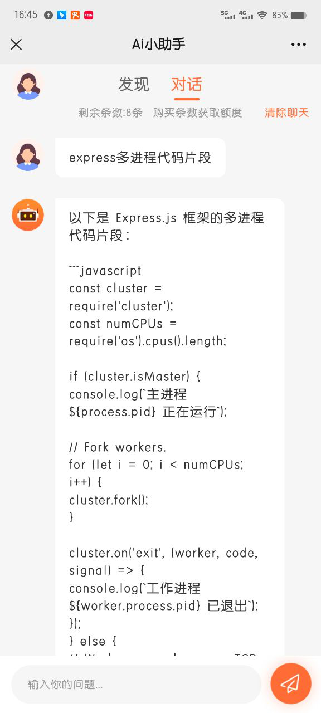
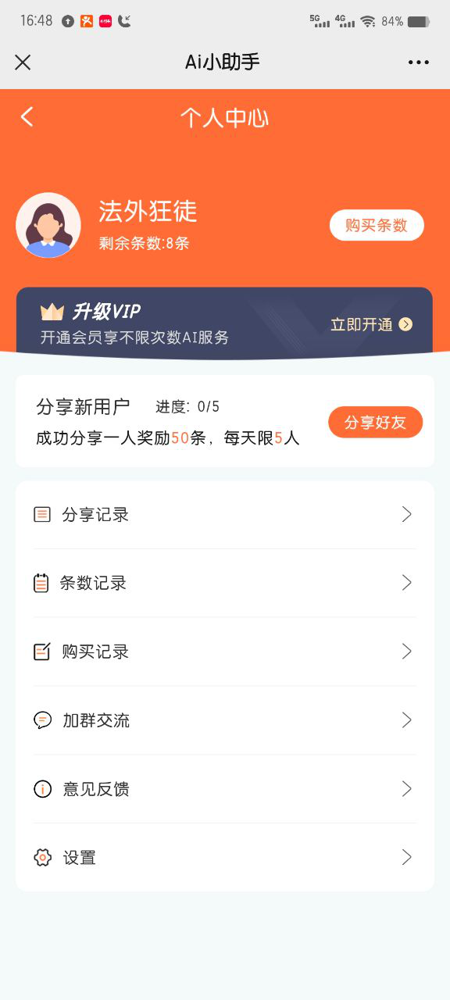
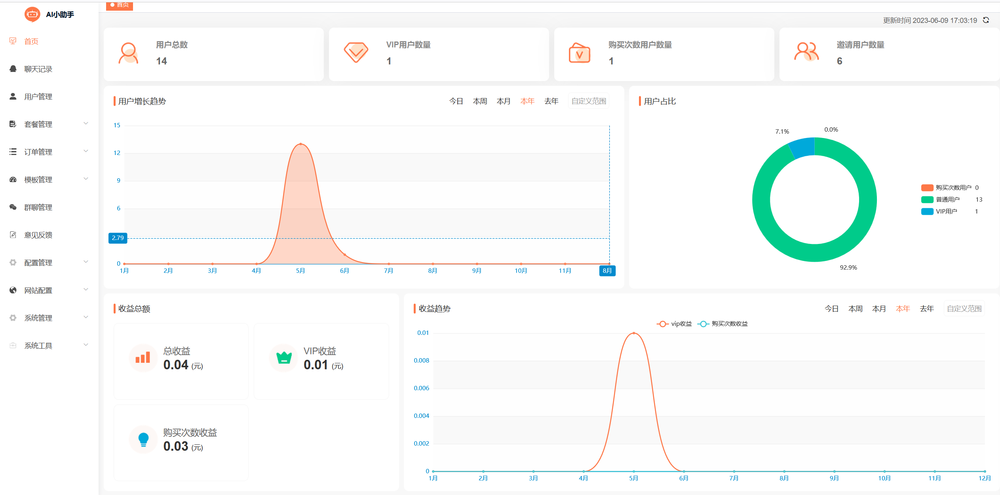
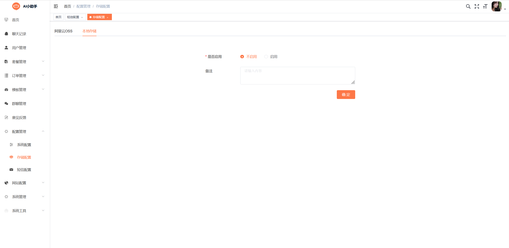
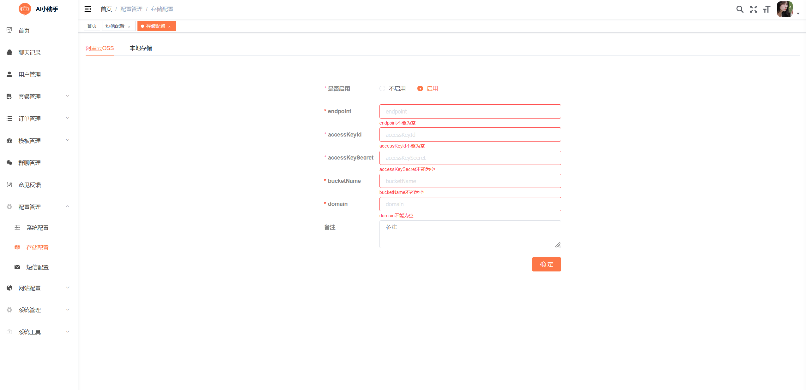
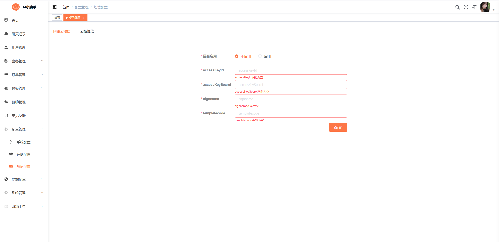
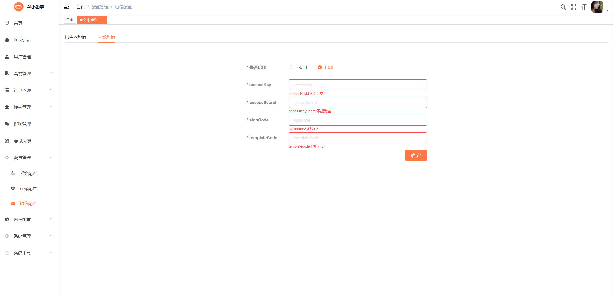
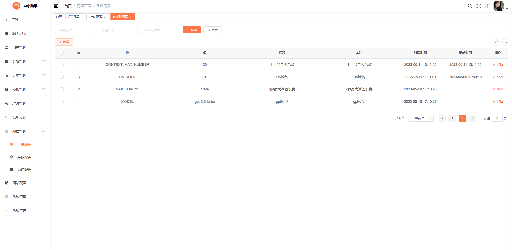

## AI小助手
>这是一个基于Java和ChatGPT开发的AI小助手项目，它可以完成用户的自然语言处理和智能对话交互。
用户可以通过与AI小助手的文字对话来获取帮助、解决问题等，AI小助手使用ChatGPT模型进行智能回答。

## 运行条件
> *  Redis
> *  MySQL数据库

## 前台展示

## 后台展示

## 运行说明
> * 配置MySQL数据库以及redis
> * 导入表结构及必要数据
> * 配置项目运行必要参数及依赖
> * 存储配置 （二选一）    

    
> * 短信配置 （二选一）  

> * 系统其他配置: 配置管理 -》系统配置    

## 技术架构
> springboot + Mybatis-plus + Redis + MySQL + ChatGPT

## 前端仓库地址
> https://github.com/tsshop/tsai-uniapp

## 交流群

